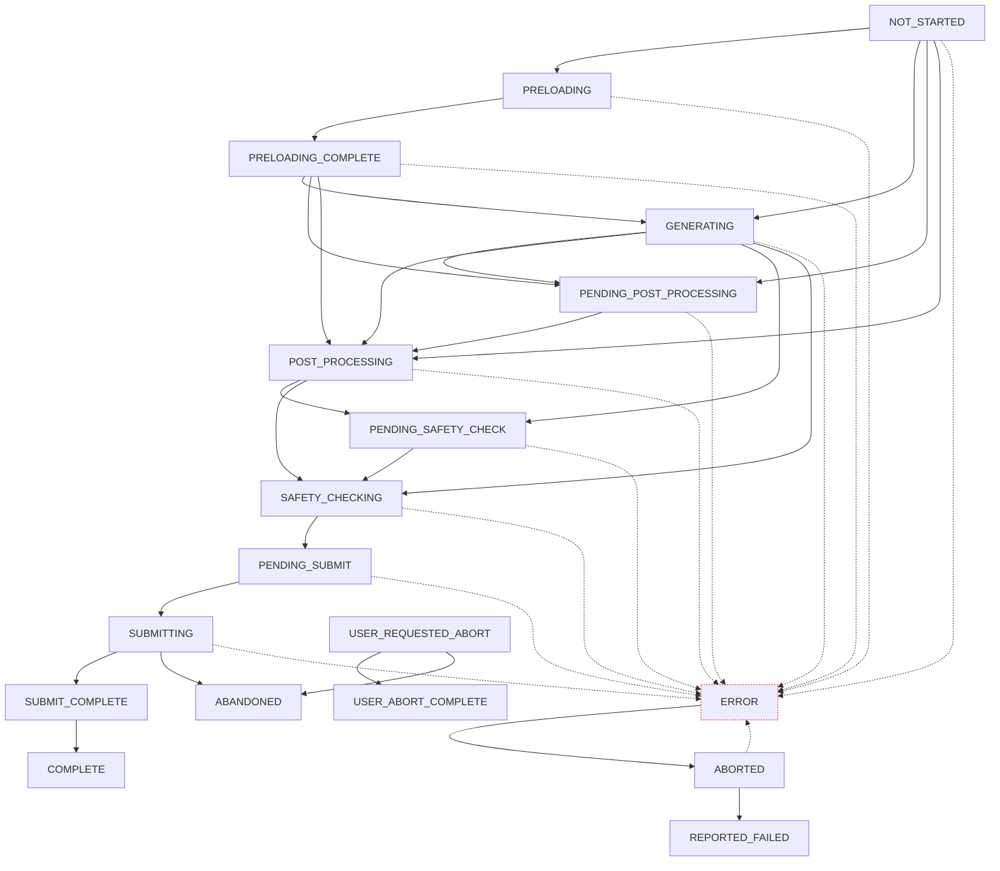

# Worker States Flow

This is visual depiction of the `base_generate_progress_transitions` map found in `horde_sdk/ai_horde_worker/consts.py`.

You should also see the [worker loop](../haidra-assets/docs/worker_loop.md) and [job lifecycle explanation](../haidra-assets/docs/workers.md) for additional details.

