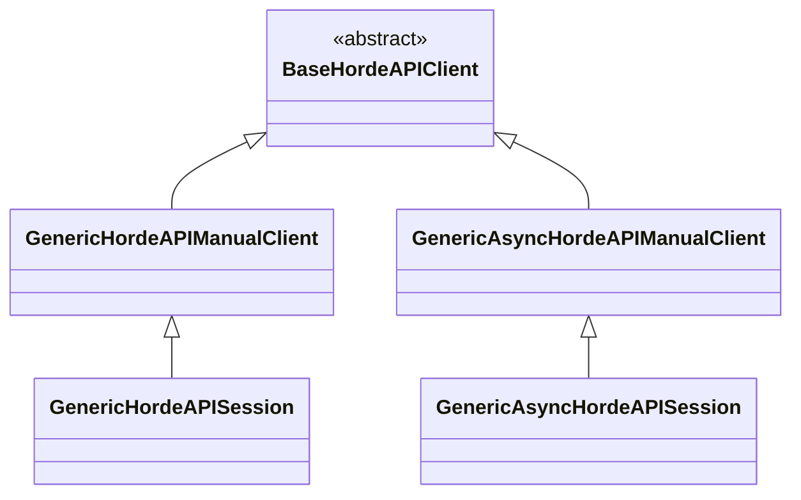
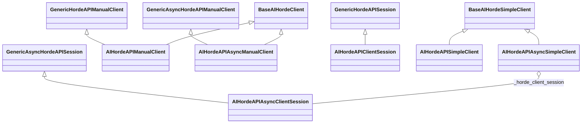

# horde_sdk API Client design concepts

## Generic API Client Class Hierarchy

```mermaid

classDiagram
    class BaseHordeAPIClient {
        <<abstract>>
    }

    class GenericHordeAPIManualClient

    class GenericAsyncHordeAPIManualClient
    class GenericHordeAPISession 

    class GenericAsyncHordeAPISession 

    BaseHordeAPIClient <|-- GenericHordeAPIManualClient
    BaseHordeAPIClient <|-- GenericAsyncHordeAPIManualClient
    GenericHordeAPIManualClient <|-- GenericHordeAPISession
    GenericAsyncHordeAPIManualClient <|-- GenericAsyncHordeAPISession

```

## AI Horde API Client Class Hierarchy

```mermaid
classDiagram
    class GenericHordeAPIManualClient
    class GenericAsyncHordeAPIManualClient
    class GenericHordeAPISession
    class GenericAsyncHordeAPISession

    class BaseAIHordeClient
    class BaseAIHordeSimpleClient

    class AIHordeAPIManualClient
    class AIHordeAPIAsyncManualClient

    class AIHordeAPIClientSession
    class AIHordeAPIAsyncClientSession

    class AIHordeAPISimpleClient
    class AIHordeAPIAsyncSimpleClient

    GenericHordeAPIManualClient <|-- AIHordeAPIManualClient
    BaseAIHordeClient <|-- AIHordeAPIManualClient

    GenericAsyncHordeAPIManualClient <|-- AIHordeAPIAsyncManualClient
    BaseAIHordeClient <|-- AIHordeAPIAsyncManualClient

    GenericHordeAPISession <|-- AIHordeAPIClientSession
    GenericAsyncHordeAPISession <|-- AIHordeAPIAsyncClientSession

    BaseAIHordeSimpleClient <|-- AIHordeAPISimpleClient
    BaseAIHordeSimpleClient <|-- AIHordeAPIAsyncSimpleClient

    AIHordeAPIAsyncSimpleClient o-- AIHordeAPIAsyncClientSession : _horde_client_session
```
