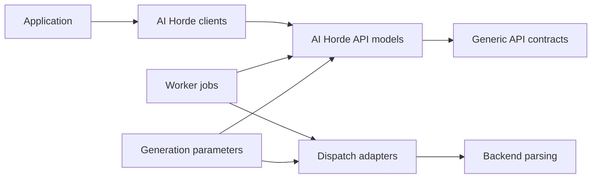

# Package architecture

<!-- BEGIN GENERATED: topics (gen_doc_index.py) -->
Topics: [architecture](../topics.md#architecture), [contributing](../topics.md#contributing)
<!-- END GENERATED: topics -->

The package points inward from service-specific contracts toward reusable mechanisms. `generic_api` defines typed HTTP
and lifecycle abstractions. `ai_horde_api` applies them to one service. `generation_parameters` captures reusable
generation intent. `worker` coordinates distributed work, while backend parsing and dispatch convert at execution
edges.

## Dependency direction

Generic contracts cannot depend on AI Horde models. Reusable generation parameters cannot depend on one backend.
Backend conversion may depend on both the normalized parameter layer and its backend representation. Utilities remain
narrow so importing a helper does not initialize client or worker subsystems.

This direction makes individual layers reusable and testable. It costs conversion code and requires discipline when a
new field seems convenient to place in a lower layer. The [package map](../reference/package-map.md) locates concrete
symbols without duplicating this rationale.
