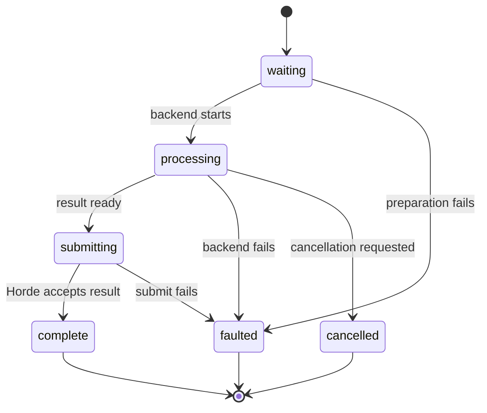

# Worker generation transitions

<!-- BEGIN GENERATED: topics (gen_doc_index.py) -->
Topics: [backends](../topics.md#backends), [generation](../topics.md#generation), [workers](../topics.md#workers)
<!-- END GENERATED: topics -->

A `HordeWorkerJob` coordinates popped work. Each `HordeSingleGeneration` represents one result and advances through
preparation, backend execution, submission, and a terminal outcome. Callers must use the object's transition methods;
direct state mutation bypasses invariants and observability.

Progress is meaningful only while backend work is active. A submit response is the confirmation for `complete`;
producing local bytes alone is not completion. Fault and cancellation paths still release backend and dispatch
resources.

## Code map

| Responsibility | Module | Symbol |
| --- | --- | --- |
| Base generation | `horde_sdk/worker/generations_base.py` | `HordeSingleGeneration` |
| Concrete generation types | `horde_sdk/worker/generations.py` | `ImageSingleGeneration` and peers |
| Job coordination | `horde_sdk/worker/job_base.py` | `HordeWorkerJob` |
| Concrete jobs | `horde_sdk/worker/jobs.py` | `ImageWorkerJob` and peers |
| State constants | `horde_sdk/worker/consts.py` | worker state enums |

Worker lifecycle behavior is covered under `tests/worker`. The [state-machine how-to](../how-to/drive-worker-state.md)
turns this contract into an integration sequence.
