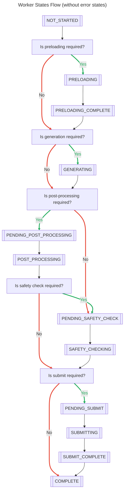
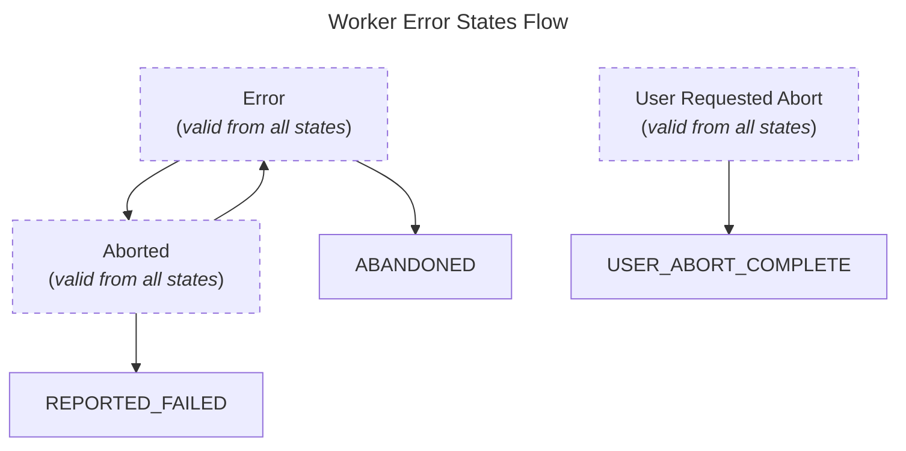
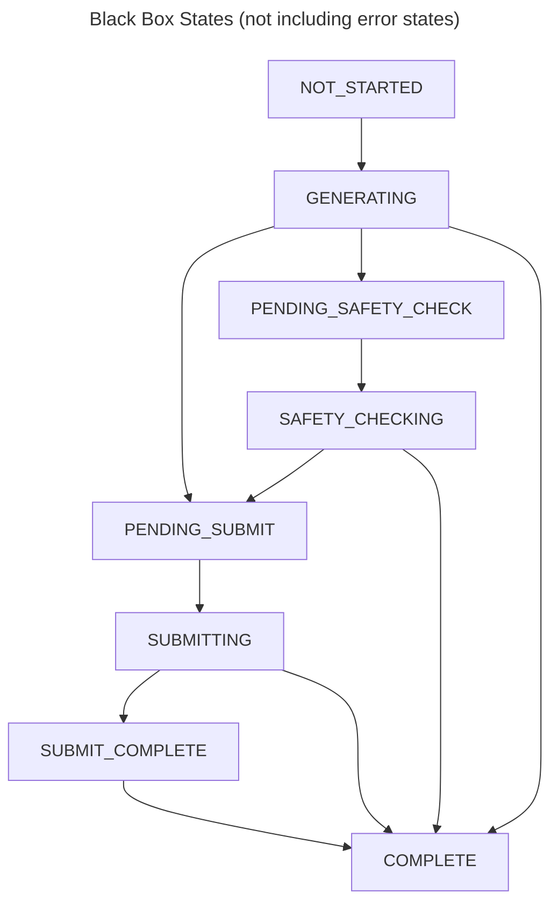
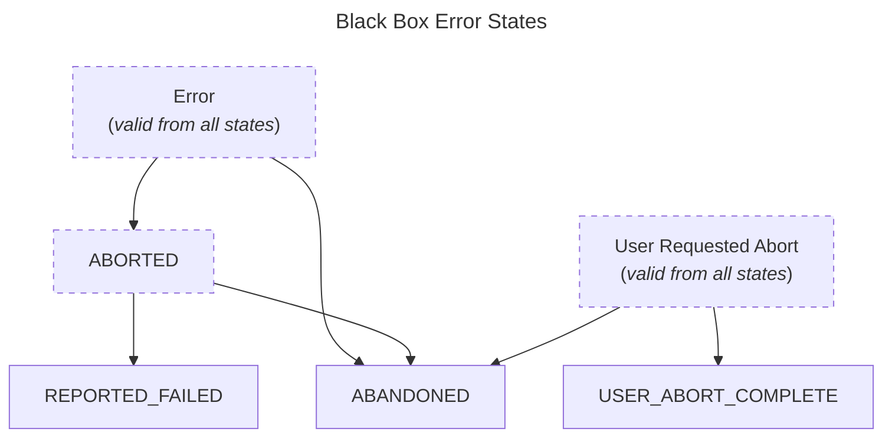

# Generation States Flow

## Typical States Flow

This is visual depiction of the `base_generate_progress_transitions` map found in `horde_sdk/worker/consts.py`.

You should also see the [worker loop](../haidra-assets/docs/worker_loop.md) and [job lifecycle explanation](../haidra-assets/docs/workers.md) for additional details.

---

---

`ERROR`, `ABORTED` and `USER_REQUESTED_ABORT` states are always valid to transition to. If transitioning to `ERROR`, it is **only** permissible to transition to the state from which the error occurred, or to `ABORTED`. If transitioning to `ABORTED`, it is only permissible to transition to `REPORTED_FAILED` or `USER_REQUESTED_ABORT`.

Consider the following good and bad examples of error transitions:

Good:

- `NOT_STARTED` -> `PRELOADING` -> `ERROR` -> `PRELOADING` -> `PRELOADING_COMPLETE` -> ...
    - In this case, the error occurred during preloading, and the worker was able to recover and continue.
- `NOT_STARTED` -> `PRELOADING` -> `ERROR` -> `PRELOADING` -> `ERROR` -> `ABORTED` -> `REPORTED_FAILED`
    - Here, the worker encountered an error during preloading, attempted to recover, but failed again and then aborted the job. Note that you can set the intended number of retries in worker job configuration. See the `HordeWorkerJobConfig` class and the  `state_error_limits` arg in a generation class constructor for more details.
- `NOT_STARTED` -> `PRELOADING` -> `USER_REQUESTED_ABORT` -> `USER_ABORT_COMPLETE`
    - In this case, the user who created the job requested an abort, and the worker was able to complete the abort process successfully.

Bad:

- `NOT_STARTED` -> `PRELOADING` -> `ERROR` -> `GENERATING`
    - If an error occurs, you have to explicitly handle it and you must transition *back* to the state from which the error occurred, or to `ABORTED`. In this case, the worker is trying to continue generating after an error occurred during preloading, which is not allowed. The correct transition would be to go back to `PRELOADING` or to `ABORTED`.
- `NOT_STARTED` -> `PRELOADING` -> `ERROR` -> `ERROR`
    - This is not allowed, as you cannot transition to `ERROR` from `ERROR`. You must handle the error and transition to a valid state, such as `ABORTED` or back to the state from which the error occurred. If this situation occurs to you frequently, you will need to review your flow and control to ensure that errors and exceptions are handled properly. Consider checking the current state before transitioning to `ERROR` and if it is already `ERROR` consider logging the error and aborting the job instead.

## Black Box States Flow

Depending on the worker backend, it may not always be possible to track all of the states. For example, it may be that the backend silently handles `PRELOADING` without a callback or hook to detect that it has started or completed. Further, some backends may ever only support a single model, so `PRELOADING` may not be applicable at all. In these cases, it is appropriate to use `black_box_mode` for these `HordeSingleGeneration` class instances.

In this case, the flow is simplified to the following (where safety checks, even if required, are also an optional state)

---

---

---

Note that a generation may still require additional steps, such as post-processing or safety checking, but it is assumed that these steps are handled internally by the backend and do not require explicit state transitions in the worker. The worker will still report the final state as `COMPLETE` or `FAILED` based on the outcome of the generation. It is incumbent on the implementor to ensure that these steps have happened as intended.
