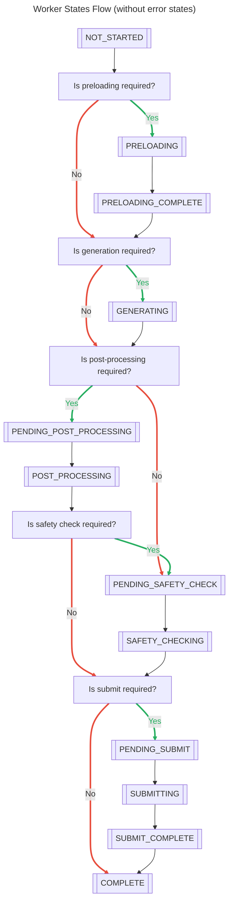
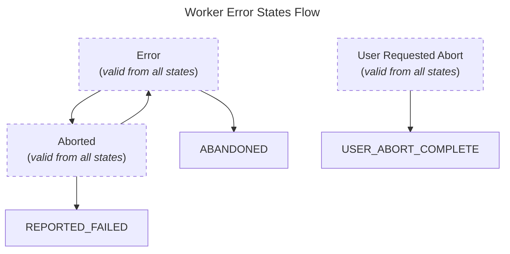
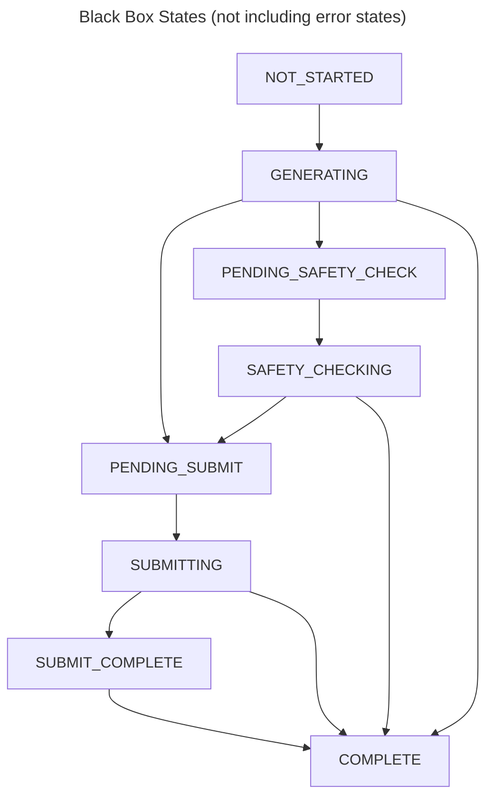
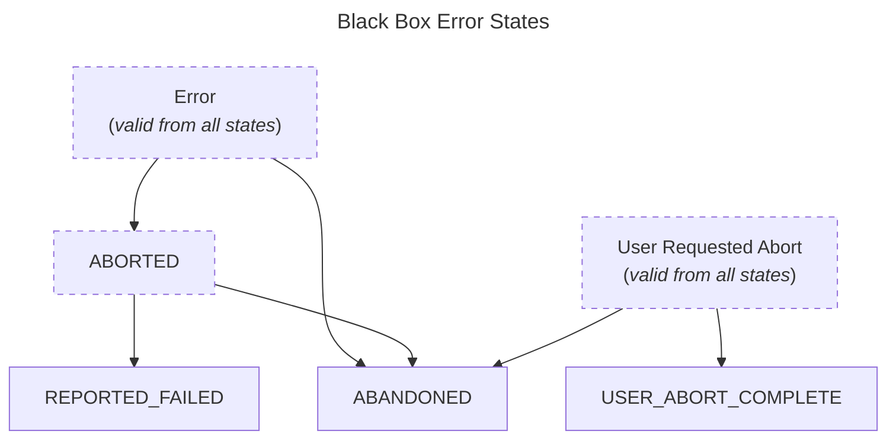

# Generations

In horde-sdk, **generations** are discrete units of work representing a single round of inference or post-processing, such as generating an image, producing text, or running an alchemy operation. Generations are not the same as jobs — a job may consist of multiple generations and contains additional metadata specific to the dispatch source. **Workers** are the entities that execute these generations, managing their lifecycle and state transitions.

See also the [relevant definitions](../definitions.md#generation).

## The `HordeSingleGeneration` Class: Core Abstraction

At the heart of the generation workflow is the `HordeSingleGeneration` class. This is an abstract base class that provides a **state machine** for managing the lifecycle of a generation. All specific generation types (e.g., image, text) inherit from this class, ensuring a consistent interface and behavior across the SDK.

Note that `HordeSingleGeneration` and its subclasses are *representations of state* and do not perform any actual inference or post-processing. They are designed to be used in conjunction with or by worker code that handles the execution of the generation logic, typically by using backend software (such as ComfyUI or KoboldCPP) to perform the actual work.

### Purpose

- **Lifecycle Management:** Tracks the progress of a generation from start to finish, enforcing valid state transitions (e.g., from "not started" to "generating", "safety checking", "complete", etc.).
- **Error Handling:** Provides mechanisms to handle errors, aborts, and recovery, with configurable limits on error states.
- **Extensibility:** Designed to be subclassed for specific generation types (e.g., `ImageSingleGeneration`, `TextSingleGeneration`), allowing custom logic while retaining core state management.
- **Standardized Interface:** Ensures that all generations follow a common pattern, making it easier to implement and maintain different types of generations for consistent behavior and improved observability.

### Key Elements

- **State Machine:** The class enforces a strict sequence of method calls, representing each step in the generation process. States are defined by the `GENERATION_PROGRESS` enum, and transitions are validated to prevent invalid workflows.
- **Thread Safety:** Internal state changes are protected by locks, making the class safe for use in concurrent environments.
- **Callbacks:** You can register callbacks to be notified when the generation enters specific states.
- **Batch and Result Tracking:** Each generation tracks its unique ID, batch size, and result IDs, making it easy to manage multiple outputs.
- **Logging:** Extra logging can be enabled for debugging and tracing state transitions.

### How to Use

1. **Subclass or Use a Concrete Implementation:** You typically use a subclass like `ImageSingleGeneration` or `TextSingleGeneration`, which inherit from `HordeSingleGeneration` and add type-specific logic.
2. **Initialize with Parameters:** Pass in generation parameters, result type, and optional safety rules. The class will validate your setup and prepare the state machine.
3. **Follow the State Sequence:** Call the appropriate methods in order (e.g., `on_preloading()`, `on_generating()`, `set_work_result()`, `on_safety_checking()`, etc.). The class will enforce correct transitions and raise errors if steps are skipped or repeated incorrectly.
4. **Handle Results and Errors:** Inspect results, safety checks, and use error handling methods (`on_error()`, `on_abort()`) as needed.

## Generation States and State Transition Methods

The lifecycle of a generation is managed by a **state machine**. Each state represents a step in the generation process, and transitions between states are strictly controlled to ensure correct workflow execution.

### Possible States

The main states (defined by the `GENERATION_PROGRESS` enum) include:

- **NOT_STARTED**: Initial state before any work begins.
- **PRELOADING**: Resources are being loaded/prepared. For inference, this would be the model loading phase.
- **PRELOADING_COMPLETE**: Preloading has finished, and the generation is ready to start.
- **GENERATING**: The actual generation (e.g., inference) is in progress.
- **PENDING_POST_PROCESSING**: Waiting to start post-processing. (if applicable)
- **POST_PROCESSING**: Post-processing is underway. (if applicable)
- **PENDING_SAFETY_CHECK**: Awaiting safety check. (if applicable)
- **SAFETY_CHECKING**: Safety check is in progress. (if applicable)
- **PENDING_SUBMIT**: Ready to submit results. (if applicable)
- **SUBMITTING**: Submission is in progress. (if applicable)
- **SUBMIT_COMPLETE**: Submission finished. (if applicable)
- **COMPLETE**: Generation is fully complete.
- **ERROR**: An error has occurred.
- **ABORTED**: The generation was aborted.
- **USER_REQUESTED_ABORT**: User requested an abort.
- **USER_ABORT_COMPLETE**: User abort process is complete.
- **ABANDONED**: The generation was abandoned.

### State Transition Methods

Each state has a corresponding method in `HordeSingleGeneration` to transition to it. These methods enforce the correct order and validate transitions:

- `on_preloading()` → `PRELOADING`
- `on_preloading_complete()` → `PRELOADING_COMPLETE`
- `on_generating()` → `GENERATING`
- `on_generation_work_complete()` → `PENDING_POST_PROCESSING` or next logical state
- `on_post_processing()` → `POST_PROCESSING`
- `on_post_processing_complete()` → next logical state
- `on_pending_safety_check()` → `PENDING_SAFETY_CHECK`
- `on_safety_checking()` → `SAFETY_CHECKING`
- `on_safety_check_complete(batch_index, safety_result)` → advances after safety check
- `on_pending_submit()` → `PENDING_SUBMIT`
- `on_submitting()` → `SUBMITTING`
- `on_submit_complete()` → `SUBMIT_COMPLETE`
- `on_complete()` → `COMPLETE`
- `on_error(failed_message, failure_exception)` → `ERROR`
- `on_abort(failed_message, failure_exception)` → `ABORTED`
- `on_user_requested_abort()` → `USER_REQUESTED_ABORT`
- `on_user_abort_complete()` → `USER_ABORT_COMPLETE`

These functions return the transitioned to state.

#### Important Notes on State Transitions

- **Strict Order:** You must call state transition methods in the correct sequence. For example, you cannot call `on_generating()` before `on_preloading_complete()`. This strictness helps catch workflow errors early. Out-of-order calls almost always indicate a problem in your logic or resource handling.
- **Error Handling:** If an error occurs at any step, use `on_error(failed_message="...")` to move the generation into the `ERROR` state. This lets you handle errors gracefully and, if needed, recover. To continue after an error, you must return to the most recent valid state before proceeding.  
    - For example, if you are in the `GENERATING` state and an error occurs, call `on_error()` to enter `ERROR`, then call `on_generating()` again to retry.
- **Dynamic States:** Some transition methods, such as `on_generation_work_complete()`, may lead to different next states depending on context (e.g., whether post-processing is required). The class handles these decisions internally, so you don’t need to manually select the next state.
- **Manual States:** You can use the generic `step(state)` or `on_state(state)` methods to transition to a specific state. However, you are responsible for ensuring the transition is valid—these methods bypass some of the built-in checks.
    - **Black-box Mode:** If enabled, most validation checks are skipped. This is useful for testing or when the backend provides limited observability (for example, if inference and post-processing without clear signals of the transition). In black-box mode, you can jump directly between states (e.g., from `GENERATING` to `SAFETY_CHECKING`) without following the usual sequence, but this is not recommended unless you fully understand the implications.

### Example: Typical State Sequence

A typical workflow might look like:

```python
generation.on_preloading()
generation.on_preloading_complete()
generation.on_generating()
generation.set_work_result(result)
generation.on_generation_work_complete()
generation.on_safety_checking()
generation.on_safety_check_complete(batch_index=0, safety_result=safety_result)
generation.on_submitting()
generation.on_submit_complete()
```

If an error occurs at any step, use:

```python
generation.on_error(failed_message="Something went wrong")
```

## Example Using `ImageSingleGeneration` for Image Generation Workflows

The `ImageSingleGeneration` class in horde_sdk models the lifecycle of an image generation job. It enforces a strict state machine, so you must call its methods in the correct order for a successful workflow.

### 1. Prepare Generation Parameters

Start by constructing the necessary generation parameters, including the prompt and any upscaling/post-processing options.

````python
from uuid import uuid4
from horde_sdk.generation_parameters.image import BasicImageGenerationParameters, ImageGenerationParameters
from horde_sdk.generation_parameters.alchemy import AlchemyParameters, UpscaleAlchemyParameters
from horde_sdk.generation_parameters.alchemy.consts import KNOWN_UPSCALERS

prompt = "A beautiful landscape with mountains and a river"
result_id = str(uuid4())

generation_params = ImageGenerationParameters(
    result_ids=[result_id],
    batch_size=1,
    base_params=BasicImageGenerationParameters(prompt=prompt),
    alchemy_params=AlchemyParameters(
        upscalers=[
            UpscaleAlchemyParameters(
                result_id=result_id,
                source_image=b"dummy_image_bytes",
                upscaler=KNOWN_UPSCALERS.RealESRGAN_x4plus,
            )
        ],
    ),
)
````

### 2. Create the Generation Object

Instantiate `ImageSingleGeneration` with your parameters and safety rules.

````python
from horde_sdk.safety import SafetyRules
from horde_sdk.worker.generations import ImageSingleGeneration

generation = ImageSingleGeneration(
    generation_parameters=generation_params,
    generation_id=str(uuid4()),
    safety_rules=SafetyRules(should_censor_nsfw=True),
)
````

### 3. State Transition Sequence

The generation object expects you to follow a specific sequence of method calls. Here’s the typical order:

#### a. Preloading (Optional)

If your workflow requires resource preloading, signal this:

````python
generation.on_preloading()
# ...load resources...
generation.on_preloading_complete()
````

#### b. Start Generation

Signal the start of generation, set the result, and mark work complete:

````python
generation.on_generating()
# ...call backend/model...
generation.set_work_result(result=b"simulated_image_bytes")
generation.on_generation_work_complete()
````

#### c. Safety Checking

Transition to safety checking and record the result:

````python
from horde_sdk.safety import SafetyResult
import random

generation.on_safety_checking()
safety_result = SafetyResult(is_csam=False, is_nsfw=random.choice([True, False]))
generation.on_safety_check_complete(batch_index=0, safety_result=safety_result)
````

### d. Submitting Results

Finalize the workflow by submitting the result:

````python
generation.on_submitting()
# ...submit to API/storage...
generation.on_submit_complete()
````

### 4. Handling Results

After submission, you can inspect the safety results and handle accordingly:

````python
if safety_result.is_nsfw:
    print("Image flagged as NSFW.")
else:
    print("Image passed safety check.")
````

### 5. Error Handling

If a step fails, use `generation.on_error(failed_message="...")` to signal an error. The state machine will allow a limited number of recoveries before aborting.

### 6. Full Example

Here’s a minimal, complete workflow:

````python
"""
Minimal example: Using horde_sdk to generate an image and perform a safety check.
Demonstrates the required state transitions for a valid workflow.
"""

import time
import random
from uuid import uuid4

from horde_sdk.generation_parameters.image import BasicImageGenerationParameters, ImageGenerationParameters
from horde_sdk.generation_parameters.alchemy import AlchemyParameters, UpscaleAlchemyParameters
from horde_sdk.generation_parameters.alchemy.consts import KNOWN_UPSCALERS
from horde_sdk.safety import SafetyResult, SafetyRules
from horde_sdk.worker.generations import ImageSingleGeneration


def main() -> None:
    # Step 1: Prepare generation parameters
    prompt = "A beautiful landscape with mountains and a river"
    result_id = str(uuid4())
    generation_params = ImageGenerationParameters(
        result_ids=[result_id],
        batch_size=1,
        base_params=BasicImageGenerationParameters(prompt=prompt),
        alchemy_params=AlchemyParameters(
            upscalers=[
                UpscaleAlchemyParameters(
                    result_id=result_id,
                    source_image=b"dummy_image_bytes",
                    upscaler=KNOWN_UPSCALERS.RealESRGAN_x4plus,
                )
            ],
        ),
    )

    # Step 2: Create a generation object
    generation = ImageSingleGeneration(
        generation_parameters=generation_params,
        generation_id=str(uuid4()),
        safety_rules=SafetyRules(should_censor_nsfw=True),
    )

    # Step 3: Preloading (optional, but shown in advanced example)
    print("Preloading resources...")
    generation.on_preloading()
    time.sleep(0.5)
    generation.on_preloading_complete()

    # Step 4: Start generation
    print("Generating image...")
    generation.on_generating()
    time.sleep(1)
    generation.on_generation_work_complete()
    # Step 4.1: Start post-processing
    generation.on_post_processing()
    time.sleep(0.5)
    generation.on_post_processing_complete()
    generation.set_work_result(result=b"simulated_image_bytes")

    # Step 5: Safety check
    print("Performing safety check...")
    generation.on_safety_checking()
    time.sleep(1)
    safety_result = SafetyResult(is_csam=False, is_nsfw=random.choice([True, False]))
    generation.on_safety_check_complete(batch_index=0, safety_result=safety_result)

    # Step 6: Submitting result
    print("Submitting result...")
    generation.on_submitting()
    time.sleep(0.5)
    generation.on_submit_complete()

    # Step 7: Handle result
    if safety_result.is_nsfw:
        print("Image flagged as NSFW.")
    else:
        print("Image passed safety check.")

    print("Done.")


if __name__ == "__main__":
    main()

````

---

### Key Points

- **State transitions are required**; skipping steps will raise errors.
- **Batch generation**: For multiple images, repeat safety check and submission for each batch index.
- **Error recovery**: Use `on_error()` if a step fails, but note the allowed number of recoveries.

For more advanced workflows (concurrency, post-processing, error handling), see the full example in `image_generation_advanced.py`.

---

This guide should help you get started with the basic usage and required method calls for the generation class in horde_sdk.


## Visualizing Worker States Flow

### Typical States Flow

This is visual depiction of the `base_generate_progress_transitions` map found in `horde_sdk/ai_horde_worker/consts.py`.

You should also see the [worker loop](../haidra-assets/docs/worker_loop.md) and [job lifecycle explanation](../haidra-assets/docs/workers.md) for additional details.



---



---

`ERROR`, `ABORTED` and `USER_REQUESTED_ABORT` states are always valid to transition to. If transitioning to `ERROR`, it is **only** permissible to transition to the state from which the error occurred, or to `ABORTED`. If transitioning to `ABORTED`, it is only permissible to transition to `REPORTED_FAILED` or `USER_REQUESTED_ABORT`.

Consider the following good and bad examples of error transitions:

Good:

- `NOT_STARTED` -> `PRELOADING` -> `ERROR` -> `PRELOADING` -> `PRELOADING_COMPLETE` -> ...
    - In this case, the error occurred during preloading, and the worker was able to recover and continue.
- `NOT_STARTED` -> `PRELOADING` -> `ERROR` -> `PRELOADING` -> `ERROR` -> `ABORTED` -> `REPORTED_FAILED`
    - Here, the worker encountered an error during preloading, attempted to recover, but failed again and then aborted the job. Note that you can set the intended number of retries in worker job configuration. See the `HordeWorkerJobConfig` class and the  `state_error_limits` arg in a generation class constructor for more details.
- `NOT_STARTED` -> `PRELOADING` -> `USER_REQUESTED_ABORT` -> `USER_ABORT_COMPLETE`
    - In this case, the user who created the job requested an abort, and the worker was able to complete the abort process successfully.
  
Bad:

- `NOT_STARTED` -> `PRELOADING` -> `ERROR` -> `GENERATING`
    - If an error occurs, you have to explicitly handle it and you must transition *back* to the state from which the error occurred, or to `ABORTED`. In this case, the worker is trying to continue generating after an error occurred during preloading, which is not allowed. The correct transition would be to go back to `PRELOADING` or to `ABORTED`.
- `NOT_STARTED` -> `PRELOADING` -> `ERROR` -> `ERROR`
    - This is not allowed, as you cannot transition to `ERROR` from `ERROR`. You must handle the error and transition to a valid state, such as `ABORTED` or back to the state from which the error occurred. If this situation occurs to you frequently, you will need to review your flow and control to ensure that errors and exceptions are handled properly. Consider checking the current state before transitioning to `ERROR` and if it is already `ERROR` consider logging the error and aborting the job instead.

### Black Box States Flow

Depending on the worker backend, it may not always be possible to track all of the states. For example, it may be that the backend silently handles `PRELOADING` without a callback or hook to detect that it has started or completed. Further, some backends may ever only support a single model, so `PRELOADING` may not be applicable at all. In these cases, it is appropriate to use `black_box_mode` for these `HordeSingleGeneration` class instances.

In this case, the flow is simplified to the following (where safety checks, even if required, are also an optional state)

---



---



---

Note that a generation may still require additional steps, such as post-processing or safety checking, but it is assumed that these steps are handled internally by the backend and do not require explicit state transitions in the worker. The worker will still report the final state as `COMPLETE` or `FAILED` based on the outcome of the generation. It is incumbent on the implementor to ensure that these steps have happened as intended.
